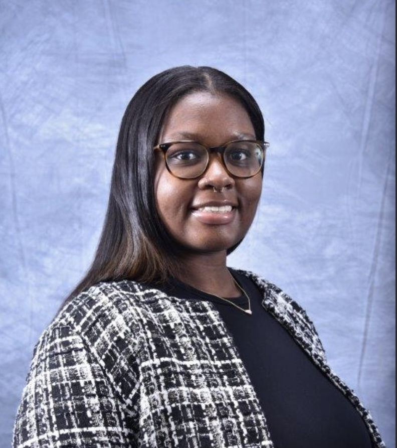

::: columns
::: {.column width="50%" style="text-align: left;"}

```{r, echo=FALSE, fig.align='left', out.width='50%'}

```

### Ashley Clark, BS, MPH'26

:::

::: {.column width="50%" style="text-align: left;"}

I’m a public health graduate student and data analyst interested in the intersection of health policy, equity, and consulting. I work with large datasets to translate complex findings into clear, actionable insights that support more informed and equitable decision-making. I’m especially passionate about using data-driven strategy to address health disparities and create practical, systems-level impact.

https://google.com

:::

